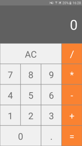

<h1>Calculadora React Native</h1>

Calculadora simples desenvolvida em React Native.

<h3>Instalação</h3>
<ul>

<li><code>https://github.com/Maauricioo/Calculadora-react-native.git</code></li>
<li><code>yarn install/npm install</code></li>

</ul>

<h3>Rodando</h3>
<ul>

<li><code>yarn run android/npm run android</code></li>

</ul>
